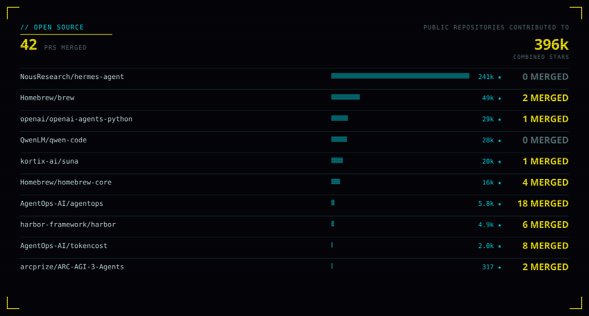

<div align="center">
  
</div>

<div align="center">
  
  <a href="https://github.com/dot-agi?tab=followers"></a>
</div>

---

## `//` DOSSIER

> I work at both ends of the stack. Days go into post-training data and evaluation
> infrastructure for frontier models; nights go into bare-metal firmware for hardware
> nobody documented. The public repos are mostly the second kind.

```console
> scan --target dot-agi --field-report

  OPERATING RANGE .... bare-metal firmware  ->  agent infrastructure  ->  quant research
  DAY JOB ............ post-training data and evals for frontier labs
  NIGHT SHIFT ........ open firmware for keyboards nobody else will support
  METHOD ............. dump it, trace the protocol, rewrite it in Rust
  PUBLISHED .......... keeberry ......... open firmware, Akko 5075B (WB32FQ95)
                       ry5088-flasher ... flasher + TUI for AT32F405 magnetic boards
                       fr8003-re ........ Freqchip FR8003A BLE radio, reverse engineered
                       DeFiLlama-Curl ... Python client for the DeFiLlama API
                       dl-benchmark ..... PyTorch vs Flux.jl on HPC
  UNDER NDA .......... agent observability, robotics LLM control, vision re-ID,
                       post-training data and evals for frontier labs
```

---

## `//` ATTRIBUTES

<div align="center">
  
</div>

---

## `//` OPEN SOURCE

<div align="center">
  
</div>

---

## `//` CYBERWARE — INSTALLED MODULES

<details open>
<summary><b>FRONTAL CORTEX</b> — <i>cognition — AI / ML</i></summary>
<br>
<div align="center">
  
  
  
  
  
  
  
  
  
</div>
</details>

<details open>
<summary><b>NEUROPORT</b> — <i>jacked in — agents & LLM stack</i></summary>
<br>
<div align="center">
  
  
  
  
  
  
  
  
</div>
</details>

<details open>
<summary><b>SANDEVISTAN</b> — <i>acceleration — GPU & compute</i></summary>
<br>
<div align="center">
  
  
  
  
  
</div>
</details>

<details open>
<summary><b>OPERATING SYSTEM</b> — <i>the languages I think in</i></summary>
<br>
<div align="center">
  
  
  
  
  
  
  
  
  
  
</div>
</details>

<details open>
<summary><b>SKELETON</b> — <i>load-bearing — embedded & firmware</i></summary>
<br>
<div align="center">
  
  
  
  
  
</div>
</details>

<details open>
<summary><b>NERVOUS SYSTEM</b> — <i>the interface layer — apps & UI</i></summary>
<br>
<div align="center">
  
  
  
  
  
  
  
  
  
</div>
</details>

<details open>
<summary><b>CIRCULATORY SYSTEM</b> — <i>what keeps it flowing — infra & delivery</i></summary>
<br>
<div align="center">
  
  
  
  
  
  
  
  
  
</div>
</details>

<details open>
<summary><b>IMMUNE SYSTEM</b> — <i>threat detection — observability</i></summary>
<br>
<div align="center">
  
  
  
  
  
</div>
</details>

<details open>
<summary><b>SHARD SLOT</b> — <i>persistent storage — databases</i></summary>
<br>
<div align="center">
  
  
  
  
  
  
</div>
</details>

<details open>
<summary><b>KIROSHI OPTICS</b> — <i>seeing the data — analysis & signal</i></summary>
<br>
<div align="center">
  
  
  
  
  
  
  
  
  
</div>
</details>

---

## `//` NET ACTIVITY

<div align="center">
  
</div>

<div align="center">
  
</div>

<div align="center">
  
</div>

---

## `//` UPLINK

<div align="center">
  <a href="https://github.com/dot-agi"></a>
  <a href="https://x.com/prattybhai"></a>
</div>

<div align="center">
  
</div>
